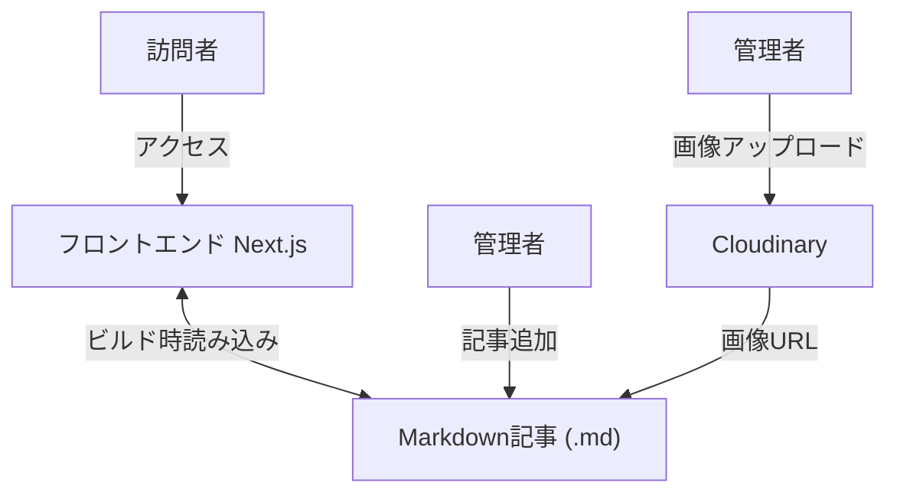

# 1. 背景と目的

- このアプリケーションは、管理者が Markdown 形式の記事を手動で追加し、静的にビルドされたブログとして公開できる Web サイトを提供します。
- 対象ユーザーは、日々の記録・技術メモ・創作などを発信したい個人開発者・執筆者です。

# システムアーキテクチャ

# 2. 機能要件

## 2.1 記事一覧ページ（トップページ）✅ 実装済み

- すべての記事の一覧をカード形式で表示
- 表示項目：タイトル、日付、簡単な抜粋、タグ
- ページ遷移：記事カードクリックで詳細ページへ
- タグフィルター機能：タグによる記事絞り込み

## 2.2 記事詳細ページ ✅ 実装済み

- Markdown 記事の全文を HTML として表示
- 表示項目：タイトル、日付、本文、タグ
- 目次自動生成機能
- シンタックスハイライト対応
- レスポンシブデザイン

## 2.3 ファイル構造 ✅ 実装済み

- posts/ ディレクトリ配下に .md ファイルを格納
- 記事ファイルは FrontMatter 形式を使用（title, date, tags, summary, thumbnail）

## 2.4 記事読み込み処理 ✅ 実装済み

- ライブラリ：gray-matter, remark, rehype
- Next.js の getStaticProps / getStaticPaths を使用して静的ページ生成
- 目次生成：remark-toc
- シンタックスハイライト：rehype-highlight
- スラグ生成：rehype-slug

## 2.5 レスポンシブ対応 ✅ 実装済み

- Tailwind CSS により PC / スマホ両対応
- フォントサイズ、余白、画像サイズを自動調整
- ダークテーマ対応

## 2.6 管理機能 ✅ 実装済み

- 画像アップロード機能（Cloudinary 連携）
- パスワード認証による管理画面
- アップロードした画像の Markdown コード生成

# 3. 非機能要件

## 3.1 技術スタック ✅ 実装済み

- フロントエンド：Next.js (React), TypeScript, Tailwind CSS
- 記事管理：Git による Markdown ファイルの追加・変更
- 画像管理：Cloudinary
- デプロイ：Vercel / Azure Static Web Apps / GitHub Pages

## 3.2 記事構文 ✅ 実装済み

- Markdown（.md）、FrontMatter
- 画像埋め込み対応
- コードブロック対応

## 3.3 SEO 対応 ✅ 実装済み

- next/head によるタイトル・メタディスクリプション設定
- 表示高速化：静的生成（SSG）

## 3.4 コメント機能

- 未対応（将来的に外部サービスで追加可能）

# 4. 制約事項

- データベース：使用しない（すべての記事は .md ファイル）
- CMS：使用しない（GUI 投稿機能なし）
- ログイン機能：管理画面あり（画像アップロード用）
- 検索機能：未実装（タグ表示による絞り込みは実装済み）

# 5. ユースケース

## 5.1 管理者が新しい記事を追加する ✅ 実装済み

1. posts/ ディレクトリに新しい .md ファイルを作成
2. FrontMatter でタイトル・日付・タグ・summary を記述
3. Markdown 本文を記載
4. 必要に応じて画像をアップロード（/admin ページ）
5. GitHub へコミット＆Push

## 5.2 訪問者が記事を閲覧する ✅ 実装済み

1. トップページで一覧表示
2. タグフィルターで記事絞り込み
3. 記事カードをクリック
4. 詳細ページで全文を閲覧

# 6. ページ一覧

| パス          | 内容                         | 実装状況    |
| ------------- | ---------------------------- | ----------- |
| /             | 記事一覧ページ（トップ）     | ✅ 実装済み |
| /posts/[slug] | 記事詳細ページ               | ✅ 実装済み |
| /admin        | 管理画面（画像アップロード） | ✅ 実装済み |
| /about        | 著者プロフィール・サイト紹介 | ❌ 未実装   |

# 7. モジュール構成

## 7.1 Post モジュール ✅ 実装済み

- getAllPosts: すべての記事メタ情報を取得
- getPostBySlug: 指定された Slug の記事データ取得
- parseMarkdown: Markdown→HTML 変換
- extractFrontMatter: gray-matter で FrontMatter 抽出

## 7.2 記事カードコンポーネント ✅ 実装済み

- 表示項目：タイトル、日付、抜粋、タグ
- クリックで /posts/[slug] に遷移

## 7.3 タグフィルターコンポーネント ✅ 実装済み

- 全タグの表示
- タグによる記事絞り込み機能

## 7.4 管理画面コンポーネント ✅ 実装済み

- 画像アップロード機能
- パスワード認証
- アップロード画像の Markdown コード生成

# 8. 追加実装された機能

## 8.1 画像管理機能 ✅ 実装済み

- Cloudinary 連携による画像アップロード
- 管理画面からの画像アップロード
- アップロードした画像の Markdown コード自動生成

## 8.2 目次自動生成 ✅ 実装済み

- remark-toc による目次自動生成
- 最大 3 階層の見出しに対応

## 8.3 シンタックスハイライト ✅ 実装済み

- rehype-highlight によるコードブロックのハイライト
- 自動言語検出対応

## 8.4 ダークテーマ ✅ 実装済み

- 黒背景のダークテーマ
- 読みやすいコントラスト設計
